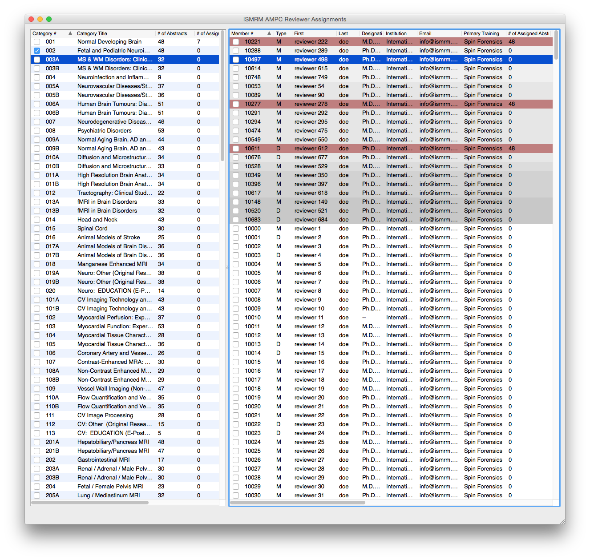

# RevAssign
The ISMRM-AMPC reviewer assignment helper software is designed to aid the
AMPC in choosing reviewers while maintaining a ledger of how many abstracts
each reviewer has been assigned [(as detailed in Jim Pipe's ISMRM
blog)](http://www.ismrm.org/12/7T.pdf).

# Operational Overview
RevAssign is essentially a spreadsheet with
a slightly more specific sorting function that allows the user to see
information about reviewer candidates (i.e. the number of abstracts they have
been assigned *and* their 5 chosen areas of expertise) while simultaneously
viewing the meeting sessions and the number of abstracts to review.  The
reviewers are sorted based on their interest in their chosen categories (as
shown in the figure below).

Reviewers (shown in the panel on the right) that have been over-committed
(those that have more than the set number of abstracts) are highlighted with a
gentle salmon color.
The reviewer's category affinity is shown in greyscale from *most interested* (at
the top in light grey) to *interested* (towards the bottom in dark grey) and then
the rest who did not choose to review the category are unsorted and shown in
white.  Each category is selected in the panel on the left.

# Controls
The user can navigate between panels using the Tab key and select categories
and reviewers using the space bar.  These can also be navigated with the mouse.

Each column can be sorted alphabetically or numerically (depending on its
content). The columns can also be positioned to the user's tastes.

Sessions can be saved as a `.mpc` file and later exported to a final `.xls`
spreadsheet to start the next process in the AMPC work flow.

# Install
RevAssign can be installed in Anaconda by running:

    $ conda install -c https://conda.anaconda.org/nckz revassign

And then run with:

    $ revassign
